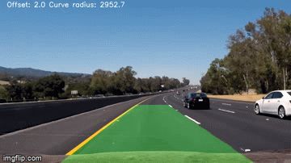

# **Advanced Lane Finding Project**

> In this project, the goal is to develope a software pipeline to identify the lane boundaries in a video from a front-facing camera on a car.

[//]: # (Image References)

[image1]: ./results/Calibration_results/Cornered/calibration2.jpg "Cornedred Chessboard"
[image2]: ./results/Calibration_results/Undistorted/calibration2.jpg "Undistorted Chessboard"

[image3]: ./results/Region/test2.jpg "Region"
[image4]: ./results/Undistort/test2.jpg "Undistorted"
[image5]: ./results/Perspective/test2.jpg "Prespective Transformed"
[image6]: ./results/Color/test2.jpg  "Color Thresholds"
[image7]: ./results/Binary/test2.jpg  "Edge Thresholds"
[image8]: ./results/Lane_pixels/test2.jpg  "Sliding window"
[image9]: ./output_images/test2.jpg  "Result"
[video1]: ./output_vedios/output_project_video.mp4 "Video"
---
### Camera Calibration

* Since this step is very streat forward, i have designed it to be a separate class/object.
* Once the object is created all needed operations will be executed automatically in the following sequance:  
  * Getting all images names from the provided directory.  
  * Start fetching images and try to find corners using [`cv2.findChessboardCorners(image, patternSize, corners, flags)`](http://docs.opencv.org/2.4/modules/calib3d/doc/camera_calibration_and_3d_reconstruction.html?highlight=findchessboardcorners#cv2.findChessboardCorners)
  * If ther defined number of corners exists, then we save both **opject_points** and **image_points**. If not, then do nothing about this image.
  * Using the previously saved points to draw corners on the images using [`cv2.drawChessboardCorners(image, patternSize, corners, patternWasFound)`](https://docs.opencv.org/2.4/modules/calib3d/doc/camera_calibration_and_3d_reconstruction.html?highlight=drawchessboardcorners#drawchessboardcorners)
  * A separate getter function wase developed for getting the valuse of both **camera matrix** and **distortion coefficient** to be used from within the main file later on.

  The implementation [HERE](https://github.com/Mohamed-Abdulaty/UDACITY-CarND-P2-Advanced-Lane-Lines/blob/7c989315c27cba3bb5935cb3ab2299960c79df67/src/Calibration.py#L6)

***Note:***  
  *All results has been saved to ./results/calibration_results/Cornered and ./results/calibration_results/Undistorted* 

| Cornered distorted  | Undistorted         |
|:-------------------:|:-------------------:|
| ![alt text][image1] | ![alt_text][image2] |

---
### **Pinpeline**

* Since there is a lot of tuning for multiple parameters. A dedecated class was created by the name [Parameters](https://github.com/Mohamed-Abdulaty/UDACITY-CarND-P2-Advanced-Lane-Lines/blob/7c989315c27cba3bb5935cb3ab2299960c79df67/src/Parameters.py#L3) and in the following steps i'll illustrate the steps and related parameters:   
  * Select region of interest (`region`)
  * Perspective transform (`source_points`) and (`destination_points`)
  * Lane pixel detection
    - Color threshold (`yellow_lane_hsv`, `white_lane_hsv`)
    - Edge detection  (`gradient_thrs_x`, `gradient_thrs_y`, `gradient_thrs_mag`, `gradient_thrs_dir`, `sobel_kernal_size`)
  * Lane detection (`window_marg`, `window_min`)
---
  #### ***Region of Interest (RoI)***
  ![alt text][image3]
  Selecting the important part of the image which shall - normally - include the lane lines, and remove the remaining part.

  This logic is implemented [HERE](https://github.com/Mohamed-Abdulaty/UDACITY-CarND-P2-Advanced-Lane-Lines/blob/7c989315c27cba3bb5935cb3ab2299960c79df67/src/Pipeline.py#L321)
  
  ---
  #### ***Distortion Correction***
  ![alt_text][image4]
  After getting the **camera matrix** and **distortion coefficient** from the calibration process. Appling them to the (RoI).

  This is implemented [HERE](https://github.com/Mohamed-Abdulaty/UDACITY-CarND-P2-Advanced-Lane-Lines/blob/7c989315c27cba3bb5935cb3ab2299960c79df67/src/Pipeline.py#L16)

  ---
  ### ***Perspective Transform***
  ![alt_text][image5] 
  The image is transformed to a bird's eye view to help calculate the road curvature.

  This is implemented [HERE](https://github.com/Mohamed-Abdulaty/UDACITY-CarND-P2-Advanced-Lane-Lines/blob/7c989315c27cba3bb5935cb3ab2299960c79df67/src/Pipeline.py#L129)

  ---
  ### ***Lane Pixel Detection***
  This step is done on tow stages:
  | 1. Color Thresholding | 2. Edge Thresholding |
  |:------------------:|:-----------------:|
  |![alt_text][image6] |![alt_text][image7]|

  The implementation for color detection/masking is [HERE](https://github.com/Mohamed-Abdulaty/UDACITY-CarND-P2-Advanced-Lane-Lines/blob/7c989315c27cba3bb5935cb3ab2299960c79df67/src/Pipeline.py#L27), and the edge detection is [HERE](https://github.com/Mohamed-Abdulaty/UDACITY-CarND-P2-Advanced-Lane-Lines/blob/7c989315c27cba3bb5935cb3ab2299960c79df67/src/Pipeline.py#L55)

  ---
  ### ***Lane Detection***
  ![alt_text][image8]
  Lanes a detected by using a sliding window that search for pixels that belong to the lane based on the pixels that were detect previously as being part of the lane

  The implementation is [HERE](https://github.com/Mohamed-Abdulaty/UDACITY-CarND-P2-Advanced-Lane-Lines/blob/7c989315c27cba3bb5935cb3ab2299960c79df67/src/Pipeline.py#L155)

  ---
  ### ***Car Position & Road Curvature***
  ![alt_text][image9]
  The calculation of the road curvature and car position with respect to the lane lines from the image has been done by carefully choosing the source_points and destination_points used in the perspective transformation step. 
  
  By using the knowledge that the width of a lane is 12 feet and the length of a lane line is 10 feet, A pixel to feet conversion function were implemented.

  The position of the car in respect to the center of the lane is calculated by finding the offset of the middle of the lane with the middle of the image.

  The curvature of the lane is done by using cv2.fitPoly which will find a best fit polynomial to the provided points.

  The implementation is [HERE](https://github.com/Mohamed-Abdulaty/UDACITY-CarND-P2-Advanced-Lane-Lines/blob/7c989315c27cba3bb5935cb3ab2299960c79df67/src/Pipeline.py#L275)

---
### The output data
* Calibration:  
  * ./results/calibration_results/Cornered
  * ./results/calibration_results/Undistorted
* The results of the pipeline:  
  * images: ./output_images
  * vedios: ./output_vedios
* Pipeline steps:  
  * ./results/Region
  * ./results/Undistort
  * ./results/Color
  * ./results/Binary
  * ./results/Perspective
  * ./results/Lane_pixels

---
## Problems & Improvements
* The region of interest selection is mainly responsible for the robustness of the pipeline since it must be tuned for the video feed.  
* The color thresholding is also tuned for the particular conditions of the video Significant inclines or declines on the road would break the assumption that the birds eye view is on a flat plane.  
  * Using LAB, and LUV color spaces could help ...
* Markers on the road that appear lane-line-like (spilled paint) will completely throw off the lane detection.  
  * In case of one solid line and the lane width the prediction could be done. However, in case of no solid line the detection could be a little harder.

